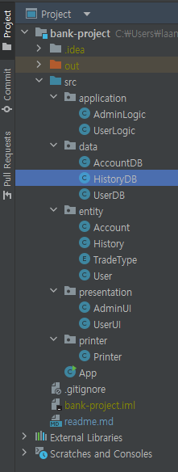
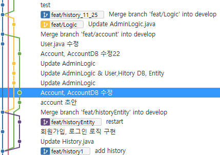

# 내일배움캠프 4기 - B반 8조

### 01. 프로젝트 명

- 조미김은행

---

### 02. 프로젝트 설명

- 이 프로젝트는 은행 내에서 이루어지는 간단한 입출금과 거래 내역 조회를 위해 만들어졌다.
- 관리자 로그인 기능으로 회원/계좌 관리가 가능하다.
- 은행 관리 시스템을 최대한 Layered Architecture 이용하여 구현
- Java의 scanner 기능 사용해서 구현.

---

### 03. 팀원 소개 및 역할

| 이름   | 역할            | 
|------|---------------|
| 조성현  | 팀장 - 발표       | 
| 김관호  | 팀원 - 기술 총책임   |
| 김동균  | 팀원 - 구현과 오류수정 |
| 김학윤  | 팀원 - 구현과 오류수정 |
| 이혜민  | 팀원 - 구현과 오류수정 |

---

### 04. 사용 기술

  
  

---

### 05. 구현사항

| Package      | Function                       | Request                | Response               |
|--------------|--------------------------------|------------------------|------------------------|
| Application  | Logic 구현                       | Data Package으로 data 요청 | Presentation에 기능 제공    |
| Data         | Data의 리스트화와 데이터 제공             | -                      | Application에 Data 제공   |
| Entity       | Object화                        | -                      | 전체 패키지에 Object 제공      |
| Presentation | UI 기능 구현                       | Application으로 로직 요청    | User에게 시각화 제공          |
| Printer      | Abstraction, 추후에 발생할 변경 비용 최소화 | -                      | 전체 프로젝트에서 추상화/변경 비용 감소 |

- Class, Method는 각자의 책임과 기능을 다하는 것으로 구현
- Layered Architecture 의 구현
- Data는 Application을 바라보고(데이터를 제공하고)
- Application은 Presentation을 바라본다(로직을 제공한다)
- Layered Architecture의 구현으로 비용 최소화, 분업의 원할함을 도모했다.
- 위 사진은 각자의 Branch로 분할 작업하는 이미지.

--- 

### 06. 관련 링크

<a href="https://giant-honeycrisp-305.notion.site/6901a11fdc3d45349e38f0171c85dacb"> 개발 일지 노션 </a>